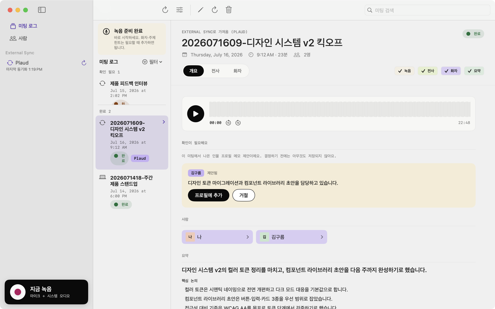
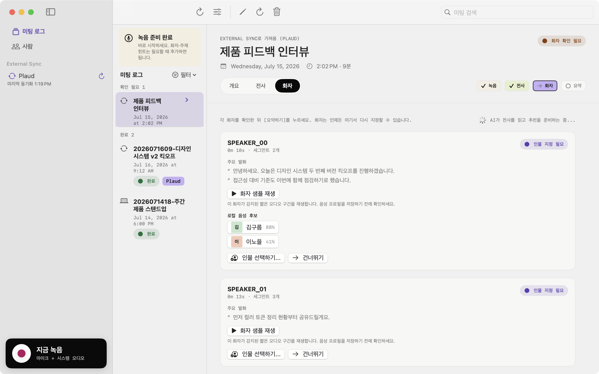

<div align="center">


**담소(談笑) - conversations, captured.**

Damso notices your meeting, asks once, and quietly takes care of the rest:
recording, transcript, who-said-what, and a summary - all on your Mac.
The name reads two ways in Korean: *담소* (a friendly chat) and *담다 + 소리* (to capture sound).


</div>

---

## Why Damso

Meeting notes tools either ship your audio to a server, make you press record after the meeting already started, or hand you a wall of anonymous text.
Damso lives in your menu bar, detects the meeting the moment your mic goes live, and builds something more durable than minutes: a local memory of the people you talk to.

- 🪄 **It notices first.** A Zoom call or a Meet tab goes live and a small card slides into the corner: *meeting detected - record?* One click, or ignore it. Nothing is ever recorded before you say yes.
- 🔄 **Your wrist recorder syncs itself.** Connect a [Plaud](https://www.plaud.ai) account through the official Plaud CLI and recordings from your wearable arrive on their own - checked hourly, deduplicated, marked with a `Plaud` chip, and fed straight into the same local pipeline.
- 🗣️ **Who said what, not just what.** Local diarization splits speakers, voice embeddings suggest who each voice is, and captured participant names from the meeting tab narrow it to one click.
- 🧑‍🤝‍🧑 **People, accumulated.** Every confirmed speaker grows a profile: meeting history, aliases, voice signature, and durable notes. Your meetings become a who-is-who you own.
- 🔒 **Local-first, files-first.** Audio, transcripts, and profiles are plain folders and Markdown on your disk. The search index is derived and always rebuildable. Audio never leaves your Mac.

<div align="center">
<picture>
  <source media="(prefers-color-scheme: dark)" srcset="docs/screenshots/main-dark.png">
  
</picture>
</div>

## How it works

```
Detect  →  Ask  →  Record  →  Transcribe (local Whisper)   →  Confirm speakers  →  Summary + title
mic +      one     approved    Diarize (local Sherpa)          one manual step      (Claude/Codex CLI)
tab check  click   session     Participants (chromux tab)                           profiles updated

External Sync (Plaud CLI)  ─────────────────────────────────↗
hourly pull · 7-day catch-up · dedup · same local pipeline
```

- **Detection is a proposal, never a decision.** Damso watches for the Zoom app and Meet/Zoom tabs in Chrome, Dia, Arc, and Safari via microphone activity. It only ever *asks*; recording starts when you press the button - on the floating card or from the menu bar.
- **Meetings end themselves.** When the mic goes quiet the recording stops after a short grace period. Recordings under five minutes are offered for discard so a misfire never pollutes your log.
- **Wearable recordings come to you.** External Sync polls the official Plaud CLI once an hour (or on demand), imports anything new from the last seven days, validates the audio, and queues it for transcription - sequentially, so a backlog never floods your machine. Interrupted work resumes on the next launch, and a watermark plus per-file index guarantees a recording is never imported twice.
- **One manual step.** After recording, transcription and speaker separation run locally and automatically. You confirm each detected voice from candidate suggestions - participant names captured live from the meeting tab appear first. The moment the last card is decided, the summary and title generate themselves.
- **Files are the source of truth.** Every meeting is a folder (`Plaud/recordings/<id>/`) of plain JSON and Markdown. The SQLite index is derived from those files and can always be rebuilt from them - deterministically, with no LLM call.
- **MCP search built in.** A read-only stdio MCP server exposes `search_meetings`, `get_meeting`, and `get_speaker`, so Claude Desktop or any MCP client can search your meetings and people locally.
- **Your choice of agent.** Summaries and titles run through the CLI you already use - Claude Code or Codex - in a sandbox that cannot read or write your meeting store, receives only transcript text, and returns only schema-validated JSON.
- **Korean or English.** The interface and all generated output follow the in-app language setting. Korean is the default.

## Speaker confirmation

Every detected voice becomes a card: play a short sample, see its strongest lines, and pick from voice-matched candidates with confidence scores - or skip it.

<div align="center">
<picture>
  <source media="(prefers-color-scheme: dark)" srcset="docs/screenshots/speakers-dark.png">
  
</picture>
</div>

## Privacy model

Read this before using automatic summaries:

- Audio never leaves your Mac. Transcription (mlx-whisper) and diarization (sherpa-onnx) are fully local.
- Meeting detection and participant capture are local signals (CoreAudio process activity, your own browser via the chromux extension). Participant names are stored in the meeting folder and never sent anywhere except as part of the transcript context you already approved.
- External Sync talks to Plaud **only through the official Plaud CLI**, read-only. Your Plaud session lives in `~/.plaud`, owned by the CLI; Damso never reads, stores, or logs a token. Login happens in your browser via `plaud login`, and downloaded audio goes straight into your local store.
- **Transcript text is sent to your selected agent CLI (Claude Code or Codex) automatically after you confirm the speakers of a meeting.** Those CLIs talk to their cloud model providers with your signed-in account. There is no per-meeting confirmation step and no sensitivity flag - if a meeting should never reach an LLM provider, do not confirm its speakers, or work without a signed-in agent CLI.
- The agent CLI is sandboxed away from your meeting store (`sandbox-exec` denies the storage root), gets an empty temporary working directory, has its built-in tools disabled, and its response is validated against a fixed JSON schema.
- The MCP server is read-only and local (stdio); it never writes meeting data and never opens a network socket.

## Install

See [INSTALL.md](INSTALL.md) for the full setup (Xcode toolchain, Python helpers, local models, Plaud CLI, and the `.app` bundle build).
It is written as a step-by-step contract an AI coding agent can follow end to end.

Quick start:

```sh
export DAMSO_STORE="$HOME/Library/Application Support/Damso"
python3 -m pip install -e '.[local-processing]'
make install-local-models
make doctor
make test
make install-local-app   # ~/Applications/Damso.app, menu bar resident
```

Optional, for Plaud wearable sync:

```sh
npm install -g @plaud-ai/cli
plaud login              # opens your browser; Damso never touches the token
```

## MCP server

```sh
DAMSO_STORE=... make mcp
```

Tools: `search_meetings(date, speaker, keyword)`, `get_meeting(stem)`, `get_speaker(name)`.
The index is rebuilt automatically by the app after each pipeline step; rebuild manually anytime with `make reindex` or the Settings action.

## Development

```sh
make verify-static       # Swift build + Python compile check
make test                # Swift tests + backend unittest suite
swift run Damso          # run the app from source
make install-local-app   # build, sign, and install Damso.app
```

## License

[MIT](LICENSE)
